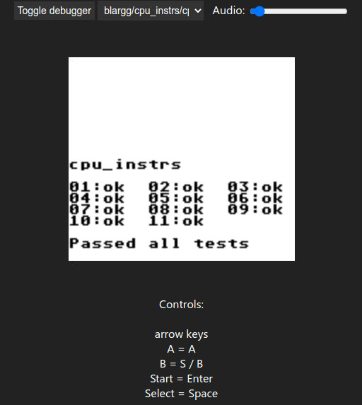

# gameboyjs
A web-based GameBoy emulator, written in TypeScript.



## Features
- Many playable games
- Working video and audio
- Progress saving inside the browser's local storage
- Passes all blargg cpu_instrs tests
- Mostly working, although there are some bugs

## How to get it running
```bash
git clone https://github.com/jakoberzar/gameboyjs.git
cd gameboyjs
npm install
cp src/sources.ts.example src/sources.ts # more info below
npm run prod
npm run serve
```
Afterwards, you can play your games by opening `localhost:3000` in browser

### Editing src/sources.ts
Currently, the emulator only supports ROMs that are available on the server. This was done to make the development process easier (instead of uploading the ROM every time).

Therefore, the server needs to know the location of your GameBoy ROMs. You can specify the file path (project root folder relative) of the ROMs in the `src/sources.ts` file. An example is provided in the `src/sources.ts.example` file.